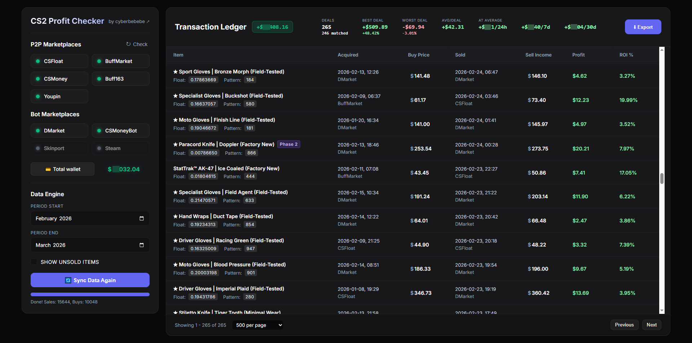

# CS2 Profit Checker   Automated CS2 Trading Profit & Tax Manager

## Supported marketplaces: **CSFloat, DMarket, Buff163, BuffMarket, Youpin, CSMoney (Market & Trade) and Skinport**

## 🔍 Features & What It Does ❓

This extension operates entirely locally on your PC. I don't know how to send data to my server, so I don't collect any data.

- 🔄 **Cross-Marketplace Matching:** Checks your login status with 1 click and fetches your **full** transaction history across all enabled marketplaces. Automatically matches purchases and sales between them.
- 💰 **Balance & Fee Calculations:** Automatically accounts for the specific selling fees of each marketplace to calculate your **true** net profit. It also calculates your total wallet balance across all connected marketplaces, including usable, pending, and frozen funds (e.g., in active bargains).
- 📈 **Profit Reports:** Generates a clean, formatted `.xlsx` file detailing your trades. Includes "Profit" and "Profit %" columns, and features auto-filters for easy sorting by Profit, Date, or Price. The Dashboard table serves as a convenient preview of this file.
- 🏛️ **Pre-Tax Reports (Accounting):** Generates a specialized `.xlsx` file structured for real legal tax processes. It supports over 20+ fiat currencies (USD, EUR, PLN, etc.) and includes a current-moment 'Stocktaking' sheet (requires manual review and adjustments).
- 📊 **Dashboard:** A convenient built-in Profit Report table where you can set or modify prices for any transaction. Includes a Statistics bar showcasing your best/worst deals and average profits (per deal, day, week, month). The table is fully sortable and paginated (defaults to 500 rows per page).

> **Notes:** Both Profit and Pre-Tax reports use the `created_at` timestamp of the transaction, **not** the completion date after trade-protection period. Profit reports and the dashboard table only support USD, and unmatched transactions default to a $0 profit. The Pre-Tax report supports multiple currencies; their exchange rates are dynamically fetched using the Frankfurter API (NBP for PLN) and perfectly align with official ECB rates.

## 📊 Dashboard Preview

## 📦 Setup / Installation

1. Download the latest extension `*.zip` from the **[Releases page](https://github.com/cyberbebebe/cs2-profit-checker/releases)**.
2. Unzip the archive to a folder on your computer.
3. Open Chromium-based browser (Chrome, Brave, Edge, Opera, etc.):
   - Go to `chrome://extensions/` (or usually "Menu -> Extensions -> Manage Extensions").
   - Enable **Developer mode** (toggle in the top right corner).
   - Click **Load unpacked**.
   - Select the folder where you unzipped the extension.
4. Pin the extension and click the icon to open the dashboard!

> **Disclaimer:** This tool provides a "Pre-Tax" report structure to assist you with tracking and accounting, but it does not replace professional tax advice. Always consult a certified accountant in your jurisdiction for final tax filings.

## ℹ️ Important notes:

1. **Long Fetching Times:** The extension fetches your **FULL** transaction history from each marketplace.
   The slowest platforms to fetch are:
   - **Buff163** - 200 transactions per request (each taking ~3 seconds).
   - **Youpin** - 20 transactions per request.
   - **CSMoney Market** - 100 transactions per request.

2. **Steam:** Used only to fetch inventory (for the Pre-Tax 'Stocktaking' sheet), not your transaction history. There are a few reasons for this:
   - Most high-volume trading occurs on 3rd-party marketplaces anyway.
   - Steam has a strict limit of 500 non-filterable transactions per request.
   - Steam trades are also not fetched as it will fetch for hours.
   - It would require inspection of every CS skin for each transaction and each trade offer.

3. **Marketplace-Specific issues:**
   - DMarket does not provide an AssetID or item "metadata" for transactions made before September 2025.
   - Skinport sales data handling might be incorrect. Your Skinport inventory fetching is also not implemented yet. (Reason: I cannot sell here, so I cannot check requests personally).
   - CSMoney's Trade section fetches only "Trade" deals and not tested personally.

4. **Commodity & Trades matching (Profit report & Dashboard)**:
   Since commodity items such as TF2 Keys, Stickers, Containers, Graffitis and Charms\* do not have unique attributes like skins do, I cannot match them by FIFO or LIFO (strange). They will **not** be matched and Profit will be set to \$0 until both Buy and Sell prices will be set manually, then profit will be calculated automatically.

   \*Charms have patterns, but they are not unique enough to be matched by only this attribute.

If you have any questions, suggestions, or encounter a bug, please open a ticket under [Issues](https://github.com/cyberbebebe/cs2-profit-checker/issues) or message me on [Steam](https://steamcommunity.com/profiles/76561198874907166).

## Created for the CS2 trading community and enthusiasts by a CS2 trader

_Developed as an interesting challenge and a useful tool._
