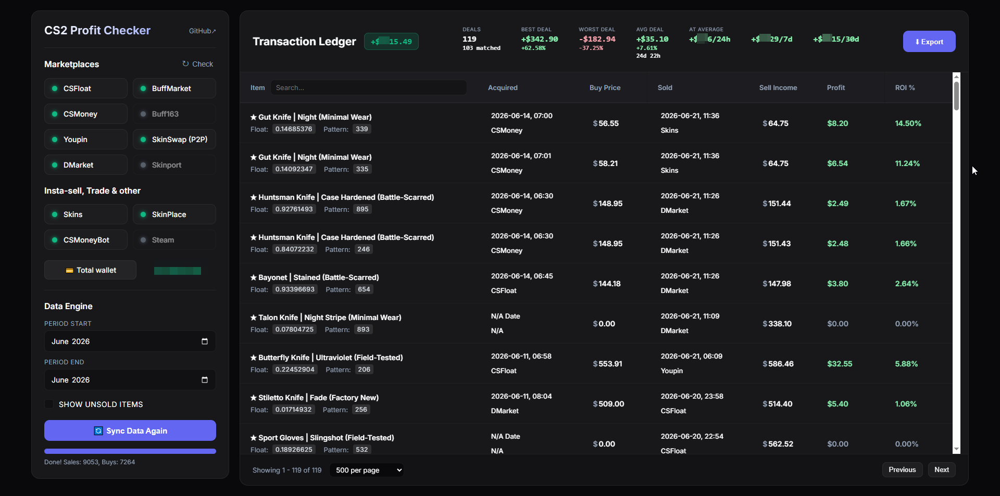

# CS2 Profit Checker   Automated CS2 Trading Profit & Tax Manager

## Supported marketplaces: **CSFloat, Buff163, Youpin, DMarket, CSMoney, BuffMarket, Skinport, Skins, SkinSwap, SkinPlace**

## 🔍 Features & What It Does

This extension operates entirely locally on your PC. It doesn't collect any data to 3rd party servers.

- 🔄 **Cross-Marketplace Matching:** Checks your login status with 1 click and fetches your **full** transaction history across all enabled marketplaces. Automatically matches purchases and sales between them.
- 💰 **Balance & Fee Calculations:** Automatically accounts for the specific selling fees of each marketplace to calculate your **true** net profit. It also calculates your total wallet balance across all connected marketplaces, including usable, pending, and frozen funds (e.g., in active bargains).
- 📈 **Profit Reports:** Generates a clean, formatted `.xlsx` file detailing your trades. Includes "Profit" and "Profit %" columns, and features auto-filters for easy sorting by Profit, Date, or Price. The Dashboard table serves as a convenient preview of this file.
- 🏛️ **Pre-Tax Reports (Accounting):** Generates a specialized `.xlsx` file structured for real legal tax processes. It supports over 20+ fiat currencies (USD, EUR, PLN, etc.) and includes a current-moment 'Stocktaking' sheet (requires manual review and adjustments).
- 📊 **Dashboard:** A convenient built-in Profit Report table where you can set or modify prices for any transaction. Includes a Statistics bar showcasing your best/worst deals and average profits (per deal, day, week, month). The table is fully sortable and paginated (defaults to 500 rows per page).

## 📊 Marketplaces Coverage

Sorted from fully to partially supported.
| Marketplace | Sell | Buy | Float | Sale Fees | Notes |
| :---: | :---: | :---: | :---: | :---: | :---: |
| **DMarket** | ✅ | ✅ | ✅ | ✅ (Automatic) | Fully supported. |
| **Buff163** | ✅ | ✅ | ✅ | ✅ (Automatic) | Fully supported. |
| **BuffMarket** | ✅ | ✅ | ✅ | ✅ (Automatic) | Fully supported. |
| **CSMoney (Market)** | ✅ | ✅ | ✅ | ✅ (Automatic) | Fully supported. |
| **CSMoney (Trade)** | ✅ | ✅ | ✅ | ✅ (No fees) | Should be fully supported. |
| **CSFloat** | ✅ | ✅ | ✅ | ✅⚠️ (2%) | Fully supported. **Sale fee is an approximation**. |
| **Youpin\*** | ✅ | ✅ | ✅ | ⚠️ (1%, Flat) | **Opens a tab to retrieve cookies. Bulk trades track up to 3 items.** |
| **Skins\*** | ✅ | ✅⚠️ | ✅ | ✅ (No fees) | **Opens a tab to retrieve cookies**. Buys are not tested, but should work. |
| **Skinport\*** | ⚠️ | ✅ | ✅ | ⚠️ | Sell transactions and fees are not tested. |
| **SkinSwap\*** | ❌ | ✅ | ❌ | ✅ | **Only Market Buy is supported**. Float data is unavailable. |
| **SkinPlace** | ✅ | ❌ | ❌ | ✅ (No fees) | **Only Sell is supported**. Float data and loyalty bonus is unavailable. |
| **Steam** | ❌ | ❌ | ✅ | ❌ | Currently used **only to check inventory** for "Stocktaking" sheet in the Pre-Tax report. |

- `✅` Fully / Automatically supported
- `⚠️` Partially supported / Limitations apply / Untested
- `❌` Not supported / Missing from API

## 👁️‍🗨️ Dashboard Preview

## 📦 Setup / Installation

1. Download the latest extension `*.zip` from the **[Releases page](https://github.com/cyberbebebe/cs2-profit-checker/releases)**.
2. Unzip the archive to a folder on your computer.
3. Open Chromium-based browser (Chrome, Brave, Edge, Opera, etc.):
   - Go to `chrome://extensions/` (or usually "Menu -> Extensions -> Manage Extensions").
   - Enable **Developer mode** (toggle in the top right corner).
   - Click **Load unpacked**.
   - Select the folder where you unzipped the extension.
4. Pin the extension and click the icon to open the dashboard!

> **Disclaimer:** This tool provides a "Pre-Tax" report structure to assist you with tracking and accounting, but it does not replace professional tax advice. Always consult a certified accountant in your jurisdiction for final tax filings.

## ℹ️ Important Notes:

1. **Long Fetching Times:** The extension fetches your **FULL** transaction history from each marketplace.
   The slowest platforms to fetch are:
   - **Buff163** - 200 transactions per request (each taking ~3 seconds).
   - **Youpin** - 20 transactions per request.
   - **CSMoney Market** - 100 transactions per request.
   - **Skins** - 50 transactions per request.

2. **Non-fetchable Items & Limitations:**
   - Fetching non-CS2 items works only on DMarket, not tested on SkinSwap, SkinPlace and Skinport.
   - Steam Community Market & Trade Histories - Multi-currency complexity, missing float data, and rate-limits makes this unfetchable.
   - Skinport: Virtual Inventory/Store is unsupported; Seller history is untested (please verify and DM me if it does not work correctly).
   - SkinSwap: Trade, Insta-Sell and Balance - I do not trade or perform instant sales here. Balance here calculated as \$0.
   - Other marketplaces - Too many exist to support all of them; I don't use all of them, and some have inconvenient history formats or other limitations.

3. **Commodity & Trade Matching (Profit Report & Dashboard):**
   Since commodity items (such as TF2,Rust,Dota items, CS Stickers, Containers, Graffitis, and Charms\*) dont have float values, they cannot be matched. Their profit will be set to \$0 until you manually enter both purchase and sale prices, after which their profit will recalculated automatically.

   \*Charms have patterns, but they are not unique enough to be matched by only this attribute.

If you have any questions, suggestions, or found a bug, please write to [Issues](https://github.com/cyberbebebe/cs2-profit-checker/issues) or message me on [Steam](https://steamcommunity.com/profiles/76561198874907166).

## Created for the CS2 trading community and enthusiasts by a CS2 trader

_Developed as an interesting challenge and a useful tool._
